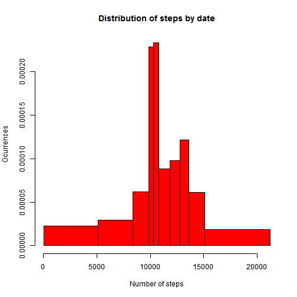
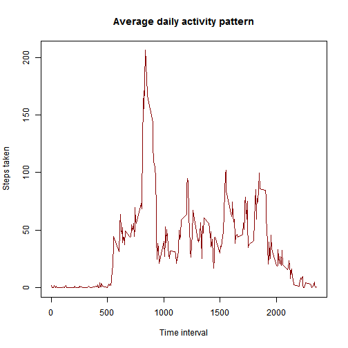
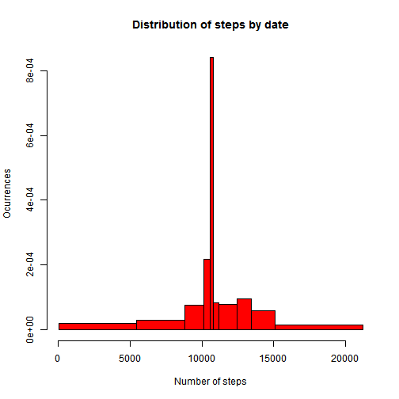
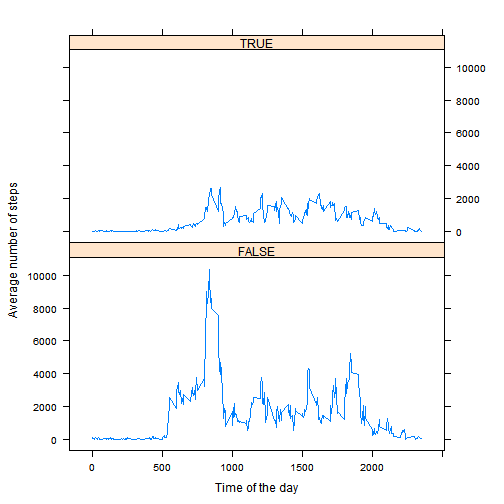

# Reproducible Research: Peer Assessment 1

We are going to study patterns in the activity of steps taken by some individuals according to the instructions given by the assignment description. 


## Loading and preprocessing the data

Fist we need to load our dataset from disk and transform the date into a suitable format for our study. 


```r
# Change Locale to use english day names
Sys.setlocale(locale = "C")
```

```
## [1] "C"
```

```r
activityDF = read.csv("activity.csv")
activityDF$date <- as.POSIXct(activityDF$date, format = "%Y-%m-%d")
```


## What is mean total number of steps taken per day?

To answer the question first we plot a histogram the steps taken on each date. We make the bins correspond to the different quantiles of the data. 


```r
stepsByDate <- aggregate(steps ~ date, activityDF, sum)
hist(stepsByDate$steps, breaks = quantile(stepsByDate$steps, probs = seq(0, 
    1, 0.1)), col = "red", xlab = "Number of steps", ylab = "Ocurrences", main = "Distribution of steps by date")
```

 


The mean steps per day is:


```r
meanSteps <- mean(stepsByDate$steps)
meanSteps
```

```
## [1] 10766
```


The median steps per day is:


```r
medianSteps <- median(stepsByDate$steps)
medianSteps
```

```
## [1] 10765
```


## What is the average daily activity pattern?

To answer the question we need to compute the mean of the data on each time interval. We do this by aggregating the data using the mean function over each of the time intervals.    


```r
meanStepsByInterval <- aggregate(. ~ interval, activityDF, mean)

plot(meanStepsByInterval$interval, meanStepsByInterval$steps, type = "l", main = "Average daily activity pattern", 
    xlab = "Time interval", ylab = "Steps taken", col = "#880000")
```

 


The 5 minute interval that contains the maximum number of steps is: 


```r
meanStepsByInterval[meanStepsByInterval$steps == max(meanStepsByInterval$steps), 
    ]$interval
```

```
## [1] 835
```


Notice that the interval corresponds to the time of the day expressed in hour and minute without any separation between them. 

## Imputing missing values

To imput missing values we are going to fill them with the mean corresponding to their interval. 


```r
nrNas <- sum(is.na(activityDF$steps) | is.na(activityDF$date) | is.na(activityDF$interval))
```


```r
proportion <- (nrNas/length(activityDF$steps)) * 100
```


The total number of missing values in the dataset is 2304. This corresponds to a 13.1148% of the total observations. 

Now we are going to fill the missing values with the mean values for the interval. 


```r
newActDF <- activityDF
means <- aggregate(steps ~ interval, newActDF, mean, na.rm = F)
newActDF[is.na(newActDF)] = means$steps
```


We plot a new interval to reflect the changes made.


```r
stepsByDate <- aggregate(steps ~ date, newActDF, sum)
hist(stepsByDate$steps, breaks = quantile(stepsByDate$steps, probs = seq(0, 
    1, 0.1)), col = "red", xlab = "Number of steps", ylab = "Ocurrences", main = "Distribution of steps by date")
```

 


We can clearly see that there are much more observations in the bin that corresponds to the 40-50% quantile. 

Now the mean steps per day is:


```r
newMeanSteps <- mean(stepsByDate$steps)
newMeanSteps
```

```
## [1] 10766
```


And the median steps per day:


```r
newMedianSteps <- median(stepsByDate$steps)
newMedianSteps
```

```
## [1] 10766
```


We can compare with the figures obtained previously, the previous mean has not changed. It was 1.0766 &times; 10<sup>4</sup> and now it is 1.0766 &times; 10<sup>4</sup>. The median on the other hand was previously 10765 and now it is 1.0766 &times; 10<sup>4</sup> so it has changed. 

## Are there differences in activity patterns between weekdays and weekends?


First we need to determine whether each of our observations was taken on a weekday or on a weekend. 


```r
library(lattice)

class(newActDF$date)
```

```
## [1] "POSIXct" "POSIXt"
```

```r
# Create a column with the weekday.
newActDF$weekday <- weekdays(newActDF$date)

# Create a factor to store whether the observation was taken on a weekend or
# on a weekday.
newActDF$isWeekend <- newActDF$weekday %in% c("Saturday", "Sunday")
newActDF$isWeekend <- as.factor(newActDF$isWeekend)
```


Now we need to aggregate the data by interval and whether it was recorded on a weekend or a weekday.


```r
stepsByInterval = aggregate(steps ~ interval * isWeekend, data = newActDF, sum)
```


Make a plot separating the activity between weekdays and weekends. 


```r
# Plot
xyplot(steps ~ interval | isWeekend, data = stepsByInterval, layout = c(1, 2), 
    xlab = "Time of the day", ylab = "Average number of steps", type = "l")
```

 


We can clearly see a more active pattern on weekdays than on weekends. 
